# PRD Context

Turn business context into approved PRDs, then use those requirements to guide implementation. Built primarily for Codex, with optional Cursor and Claude adapters sharing one Python MCP server, canonical skills, and index.

This is a proposed PRD convention. Bundled PRDs are synthetic examples; replace them before real product use.



[Interactive diagram](docs/architecture/prd-context.html) · [PRD convention](docs/prd-standard.md) · [PRD template](core/PRD_TEMPLATE.md)

## Quick start

Requires Codex, Python 3.11+, uv, and macOS or Linux.

```sh
git clone https://github.com/AhmedAbdelhady24/prd-context.git
cd prd-context
uv sync --directory server --frozen
python3 scripts/sync_adapters.py
codex
```

Trust the workspace and review the five project hooks through `/hooks`. Confirm the `prd` server with `codex mcp list`.

## Workflow

1. `$prd-author` turns business notes into a draft with stable REQ IDs and testable acceptance criteria.
2. The product owner resolves open decisions and approves the PRD.
3. `$prd-reindex` refreshes the shared index.
4. `$prd-consult` or `$prd-ask` answers from approved evidence with citations, or says “not documented.”
5. `$prd-implement` carries out authorized work with requirement traceability.

Only explicit authoring writes PRDs. Drafts and superseded documents are excluded from retrieval. Pure refactors do not need a PRD query.

## Verification

```sh
python3 scripts/sync_adapters.py --check
server/.venv/bin/python tests/check.py
server/.venv/bin/python tests/review_checks.py
```

Codex passed the ten golden questions, skill-trigger tests, and native hook checks. Optional clients have separate qualification limits. See [verification status](evals/cross_agent/status.md), the [live workflow test](docs/testing.md), and [detailed setup](docs/setup.md).
